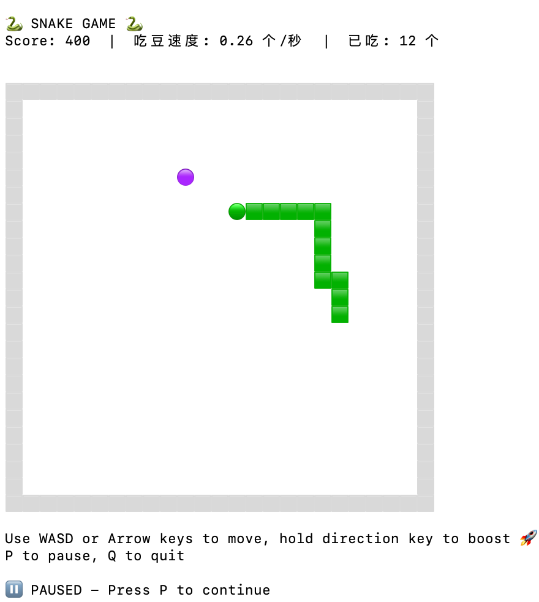

# 🐍 Snake Game (Go Terminal)

一个使用 Go 语言编写的终端贪吃蛇游戏，使用 Emoji 字符渲染，支持跨平台。


## ✨ 特性

- 🎮 经典贪吃蛇玩法
- 🎨 使用 Emoji 字符渲染，视觉效果佳
- ⌨️ 支持方向键和 WASD 控制
- ⏸️ 支持暂停/继续游戏
- 💥 碰撞爆炸效果
- 🔄 游戏结束后可快速重开
- 📦 单文件编译，无依赖运行

## 🎯 游戏截图


## 🚀 快速开始

### 从源码运行

```bash
# 克隆仓库
git clone https://github.com/YOUR_USERNAME/snake_go.git
cd snake_go

# 安装依赖
go mod tidy

# 运行游戏
go run main.go
```

### 编译可执行文件

```bash
# 编译当前平台
go build -o snake_game main.go

# 运行
./snake_game
```

### 交叉编译

使用构建脚本编译多平台版本：

```bash
chmod +x build.sh
./build.sh
```

这将在 `dist/` 目录生成：
- `snake_game_mac_arm64` - macOS Apple Silicon
- `snake_game_mac_amd64` - macOS Intel
- `snake_game_windows.exe` - Windows
- `snake_game_linux` - Linux

## 🎮 游戏控制

| 按键 | 动作 |
|------|------|
| ↑ / W | 向上移动 |
| ↓ / S | 向下移动 |
| ← / A | 向左移动 |
| → / D | 向右移动 |
| P / 空格 | 暂停/继续 |
| Q | 退出游戏 |
| R | 重新开始（游戏结束后）|

## 🎨 游戏元素

| Emoji | 含义 |
|-------|------|
| ⬜ | 墙壁 |
| 🟢 | 蛇头 |
| 🟩 | 蛇身 |
| 🔴 | 食物 |
| 💥 | 碰撞点 |

## 📁 项目结构

```
snake_go/
├── main.go      # 游戏主程序
├── build.sh     # 多平台构建脚本
├── go.mod       # Go 模块文件
├── go.sum       # 依赖校验文件
└── README.md    # 项目说明
```

## 🔧 依赖

- [github.com/eiannone/keyboard](https://github.com/eiannone/keyboard) - 终端键盘输入处理

## 📝 实现原理

### 蛇的移动
蛇使用坐标点数组存储，移动时在头部插入新坐标，删除尾部坐标，形成移动效果。

### 游戏循环
使用 Go 的 `time.Ticker` + `select` 实现事件驱动的游戏循环，同时处理定时更新和键盘输入。

### 渲染
使用 Emoji 字符进行渲染，解决了传统 ASCII 字符在终端中宽高比不一致的问题。

## 📄 License

MIT License

## 🤝 贡献

欢迎提交 Issue 和 Pull Request！
