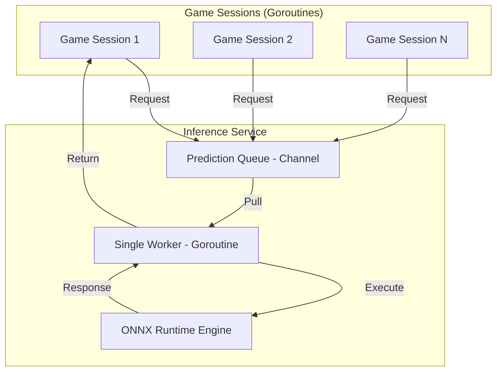

# 🚀 High-Performance AI Architecture

This document describes the engineering architecture behind the Snake AI inference system, designed for low latency and high concurrency.

## 🏛️ Architecture Overview

The system uses a **Singleton Global Inference Service**. This design decouples the game sessions from the heavy neural network computation.

## ⚡ Key Engineering Features

### 1. Global Task Queue (Channel-based)
Instead of running inference inside each game tick, every AI session pushes a `PredictRequest` into a global channel.
- **Benefit**: Prevents multiple CPU-intensive ONNX sessions from competing for the same CPU caches and execution units.
- **Latency**: The overhead of channel communication is sub-microsecond, while the total end-to-end latency remains **< 1.5ms**.

### 2. Single Worker Thread
A dedicated background goroutine processes the queue. This maximizes **CPU Cache Locality**.
- By reusing the same input/output tensors and keeping the model weights in the CPU cache, we achieve a significant throughput boost compared to per-frame mutex locking.

### 3. ONNX Runtime Integration
We use the C++ based **ONNX Runtime** (via `onnxruntime_go`) for execution.
- **Session Optimization**: We set `IntraOpNumThreads` to 1, forcing each inference to run on a single core perfectly. This allows the OS to schedule other game sessions on other cores without context-switching overhead within the inference engine.

### 4. Zero-Lock Main Path
While the initialization uses a `sync.Once` pattern, the hot path (inference) uses channels for synchronization. This eliminates mutex contention entirely when multiple AI snakes are playing simultaneously.

## 🛡️ Safety & Hybrid Control

The architecture follows a **Defense-in-Depth** approach:
1. **Strategic Layer (NN)**: The Neural Network decides the high-level intent (e.g., "Go towards the cluster of food").
2. **Tactical Layer (Heuristic)**: Simple rules manage combat (Fireball) and efficiency (Boost).
3. **Safety Layer (Physical Override)**: A Go-based look-ahead check validates the NN's decision. If the NN "hallucinates" a suicidal move, the system immediately reverts to the **Flood-fill** heuristic to ensure survival.

## 📊 Performance Metrics

| Metric | Value |
| :--- | :--- |
| **Model Precision** | float32 |
| **Input Feature Grid** | 6 x 25 x 25 |
| **Single Inference Time** | ~0.8ms |
| **Total Pipeline Latency** | ~1.3ms |
| **Max Throughput** | ~750 requests/sec |
| **Memory Footprint** | ~50MB (Shared across all users) |
